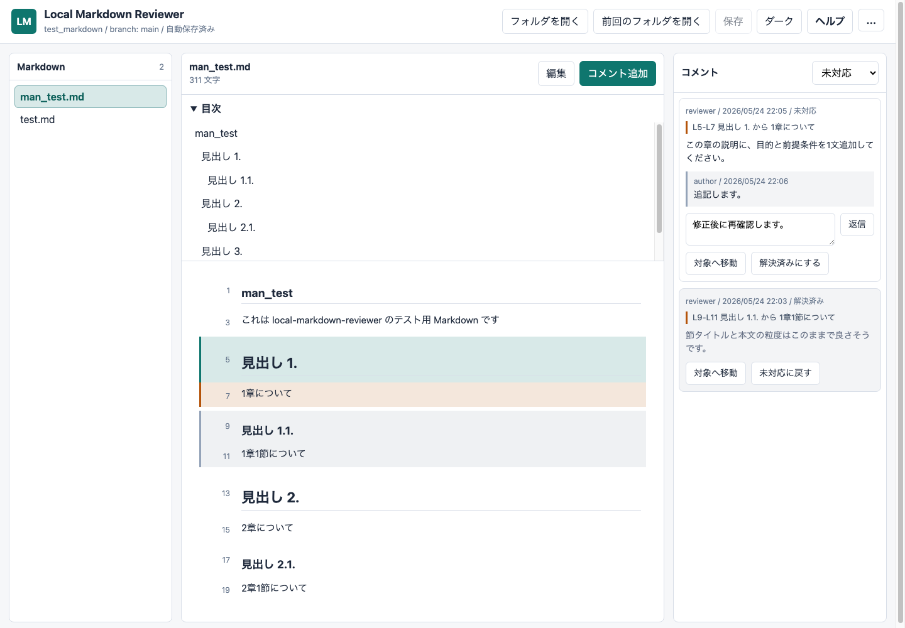
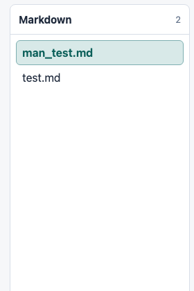
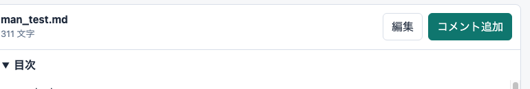
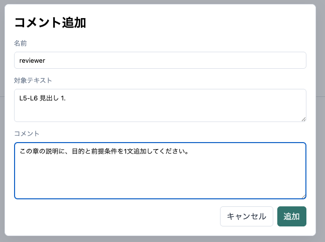
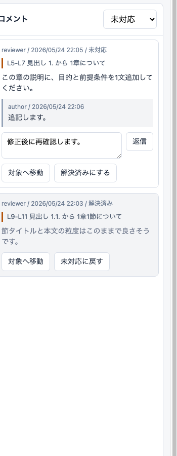
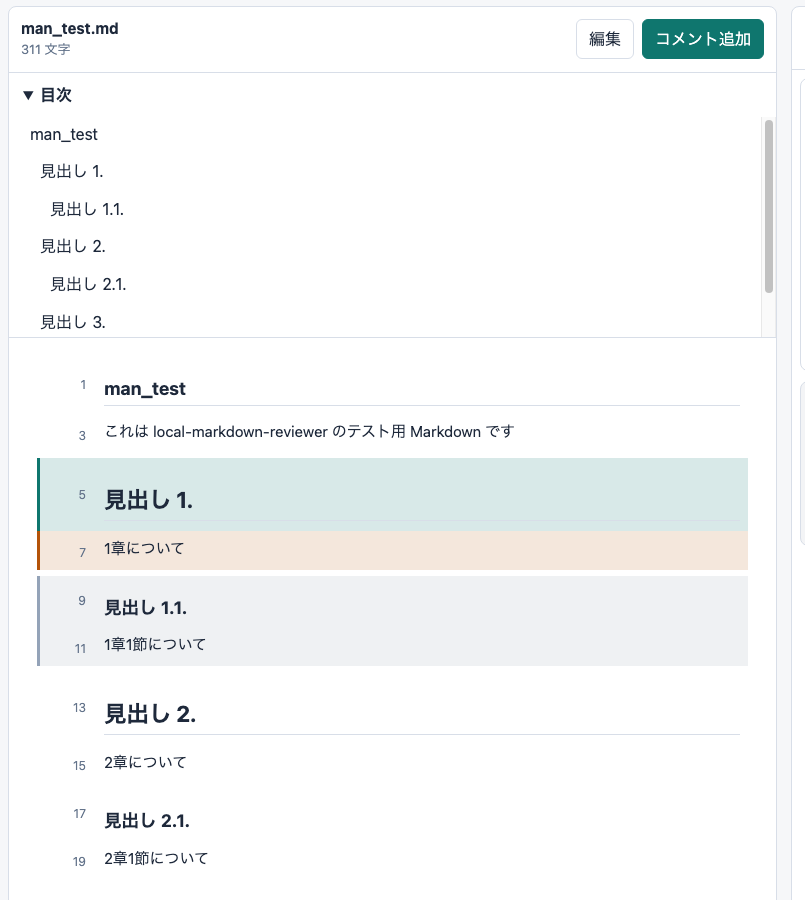
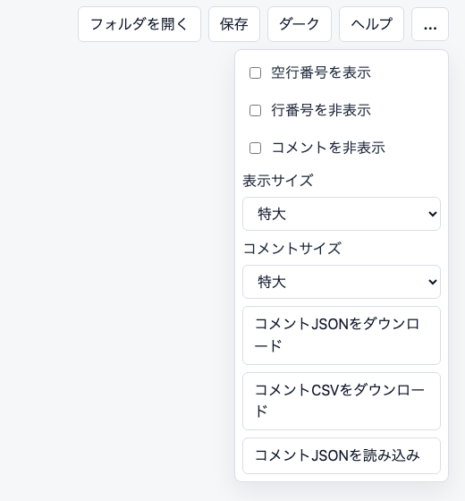
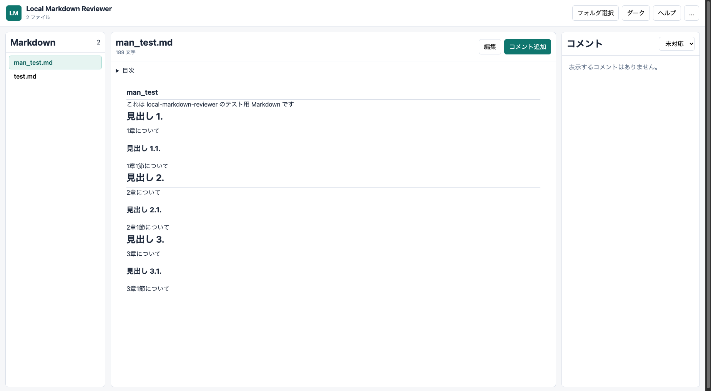
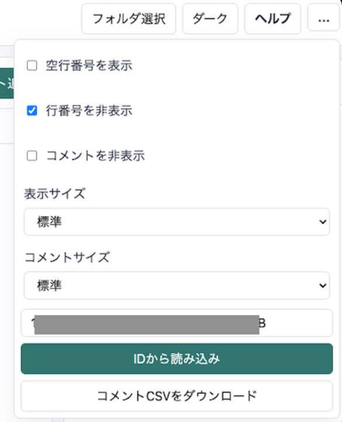

# Local Markdown Reviewer 操作マニュアル

このマニュアルでは、Local Markdown Reviewer のローカル版を中心に基本操作を説明します。

## 1. 画面構成

画面は主に3つの領域に分かれています。

- 左: Markdown ファイル一覧
- 中央: Markdown プレビューまたは本文編集欄
- 右: コメント一覧

上部には、フォルダ操作、保存、テーマ切り替え、ヘルプ、その他メニューがあります。

## 2. フォルダを開く

1. `フォルダを開く` を押します。
2. レビュー対象の Markdown ファイルがあるフォルダを選択します。
3. 左側に Markdown ファイル一覧が表示されます。

4. ファイルを選択すると中央にプレビューが表示されます。

次回以降は `前回のフォルダを開く` から再接続できます。選択したフォルダが Git リポジトリの場合、上部に現在の branch が表示されます。

## 3. コメントを追加する

1. プレビュー左側の行番号、または、プレビュー本文の対象範囲をドラッグして選択します。
2. `コメント追加` を押します。

3. コメント本文を入力します。

4. `追加` を押します。

コメントは対象フォルダ内の `.local-markdown-reviewer/user-*.json` に自動保存されます。

## 4. コメントを確認する

右側のコメント一覧から、コメント本文、対象位置、返信、状態を確認できます。

- `対象へ移動`: 対象行へスクロールします。
- `解決済みにする`: コメントを解決済みにします。
- `未対応に戻す`: 解決済みコメントを未対応へ戻します。
- 返信欄: コメントに返事を追加します。

コメント位置が本文変更でずれた場合は、対象テキスト、前後文脈、見出し情報から再検出します。完全に追跡できない場合も、コメントは削除されず `位置不明` として残ります。

## 5. コメント表示を切り替える

コメント一覧上部のセレクトで表示対象を切り替えます。

- `未対応`: 未対応コメントのみ表示
- `すべて`: すべてのコメントを表示
- `解決済み`: 解決済みコメントのみ表示

その他メニューの `コメントを非表示` を有効にすると、右側のコメント一覧と本文上のコメント色を隠し、単純な Markdown Viewer として利用できます。

## 6. Markdown 本文を編集する

1. ファイルを選択します。
2. `編集` を押します。
3. 中央の編集欄で Markdown を編集します。
4. `本文保存` を押します。

編集を破棄する場合は `キャンセル` を押します。編集モード中でもコメント一覧の `対象へ移動` は利用でき、編集欄内の対象行へ移動します。

## 7. 目次を使う

Markdown に見出しがある場合、プレビュー上部に `目次` が表示されます。目次から見出し位置へ移動できます。

## 8. 表示設定を変更する

上部のその他メニューから表示を調整できます。

- 空行番号を表示
- 行番号を非表示
- コメントを非表示
- 表示サイズ
- コメントサイズ
- コメント CSV ダウンロード
- コメント JSON ダウンロード / 読み込み

設定はブラウザの localStorage に保存され、次回以降も維持されます。

## 9. Google Apps Script 版

Google Drive 上の Markdown をレビューする場合は `gas/` 配下のファイルを Apps Script に配置します。

1. Google Apps Script で新規プロジェクトを作成します。
2. `Code`、`Index`、`Styles`、`Client` の4ファイルを作成します。
3. `gas/` 配下の内容をそれぞれ貼り付けます。
4. Web アプリとしてデプロイします。
5. `フォルダ選択` から Google Drive フォルダを選びます。

GAS 版は対象 Drive フォルダ内の `.local-markdown-reviewer/user-*.json` にコメントを保存します。

GAS 版のその他メニューでは、表示設定、Drive folder ID からの読み込み、コメント CSV ダウンロードを利用できます。

## 10. 複数人で使う

コメントはユーザ別 JSON として保存されます。Google Drive、NFS、共有ファイルサーバ、Git などで対象フォルダを同期することで、複数人のコメントを合成して表示できます。

推奨フロー:

1. 作成者が Markdown を共有します。
2. レビュアーがコメントを追加します。
3. `.local-markdown-reviewer/user-*.json` を共有またはコミットします。
4. 作成者が修正します。
5. 対応済みコメントを解決済みにします。

## 11. 困ったとき

- ファイルが表示されない: Markdown 拡張子が `.md`、`.markdown`、`.mdown` のいずれかか確認します。
- 保存できない: Chromium 系ブラウザで開いているか確認します。
- Mermaid が図にならない: `mermaid.min.js` が `index.html` と同じフォルダにあるか確認します。
- Markdown 表示が簡易的になる: `markdown-it.min.js` が `index.html` と同じフォルダにあるか確認します。
- GAS 版が真っ白になる: Apps Script のファイル名、V8 ランタイム、再デプロイを確認します。
